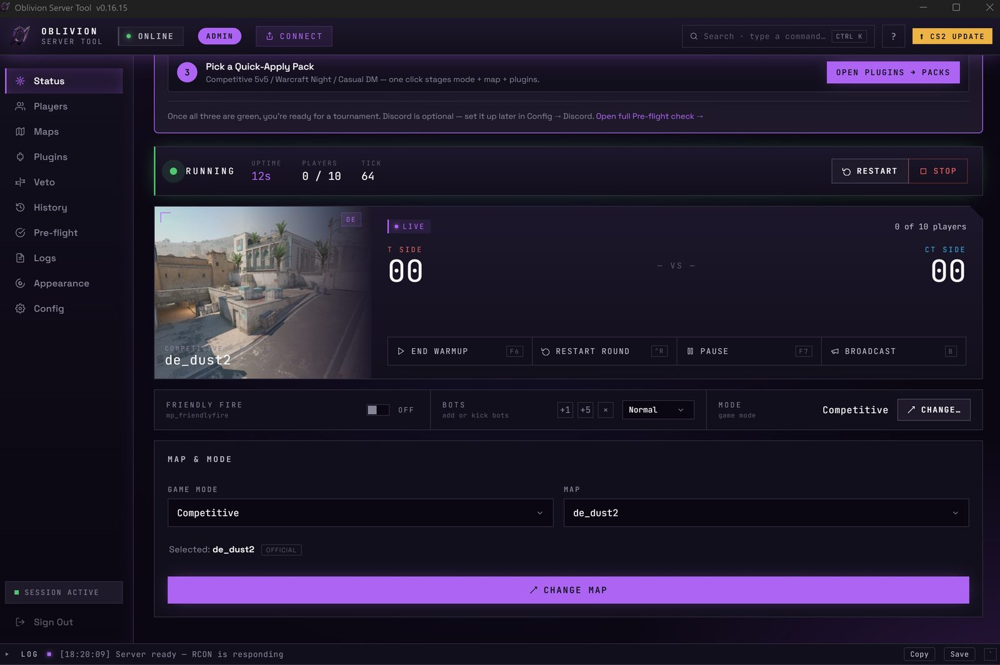
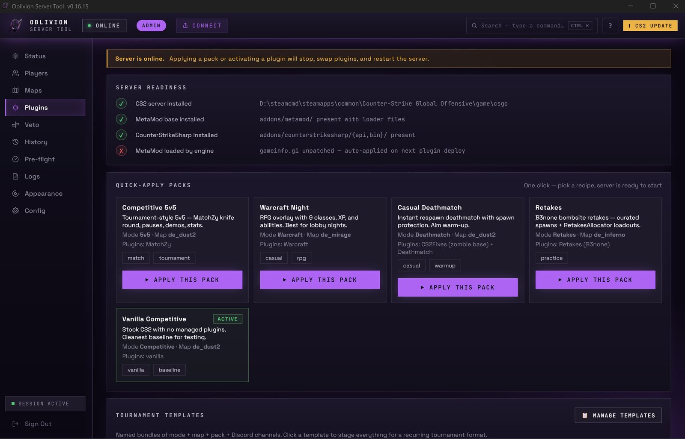
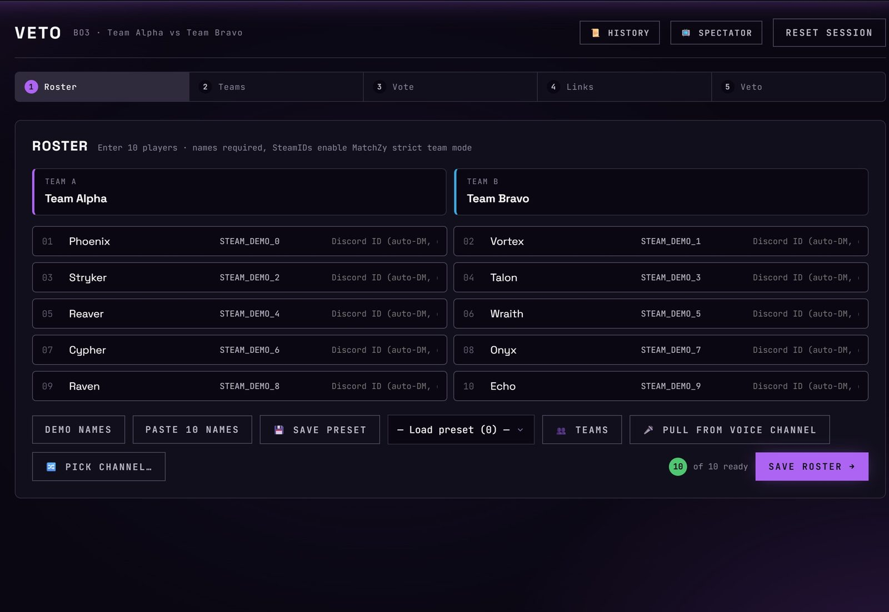
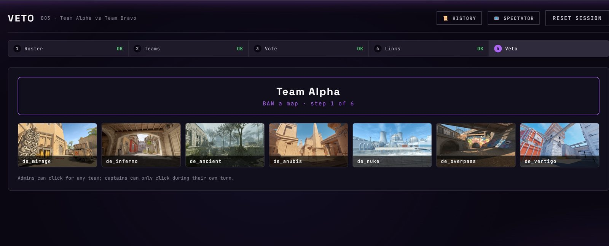
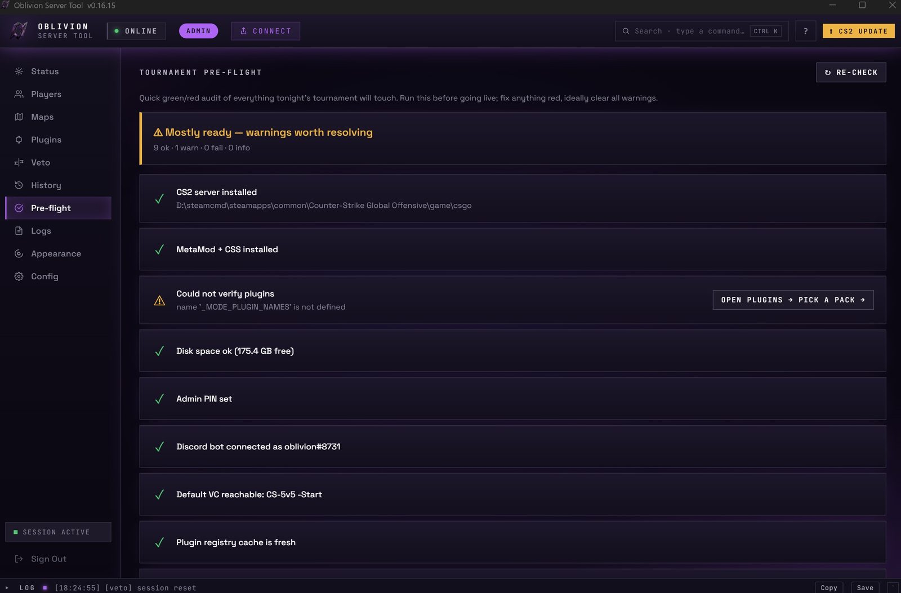

# Oblivion Server Tool

A desktop application for managing a **Counter-Strike 2 dedicated server**.
Windows ships as a single `.exe` (desktop window via Edge WebView2);
Linux runs headless via Docker or systemd, administered from the web panel.

[](https://ko-fi.com/jacquesvn)
[](LICENSE.md)
[](tests/)


> **Status: v1.1.0** — Linux + headless support shipped.  Windows still
> ships as the single `.exe` with the WebView2 desktop window; Linux
> operators get headless via Docker (`ghcr.io/oblivion-systems/oblivion-server-tool:1.1.0`)
> or a systemd unit, administered through the same web panel.  Fifty-plus
> releases of evening + weekend work, dozens of live tournaments, 314
> backend tests green on both Windows and Linux, bundled patched
> WarcraftPlugin source published, every plugin author credited.
> Anything tagged before v1.0 was a draft.
>
> Full per-release prose lives in [CHANGELOG.md](CHANGELOG.md); spec for
> the map-veto feature in [VETO.md](VETO.md); plugin-author guide in
> [PLUGINS.md](PLUGINS.md); operator-facing runbook in
> [TROUBLESHOOTING.md](TROUBLESHOOTING.md).

---

## Screenshots

<a href="docs/screenshots/02-status-running.jpg"></a>

<table>
  <tr>
    <td width="50%"><a href="docs/screenshots/05-plugins-packs.jpg"></a><br/><sub><strong>One-click tournament setup.</strong> Quick-Apply Packs stage a mode + map + plugin set in a single click.</sub></td>
    <td width="50%"><a href="docs/screenshots/06-veto-roster.jpg"></a><br/><sub><strong>Tournament workflow.</strong> Roster → random 5+5 → captain election → live veto board on captains' phones.</sub></td>
  </tr>
  <tr>
    <td width="50%"><a href="docs/screenshots/09-veto-board.jpg"></a><br/><sub><strong>Map veto.</strong> BO1 / BO3 / BO5 with single-use captain links, QR codes for phone scanning, MatchZy handoff at finale.</sub></td>
    <td width="50%"><a href="docs/screenshots/11-plugins-readiness.jpg"></a><br/><sub><strong>Server readiness.</strong> Continuous check of the four things that make a plugin actually load — green if and only if it works.</sub></td>
  </tr>
</table>

<details>
<summary>More screenshots</summary>

- [Status — Getting Started card](docs/screenshots/01-status-getting-started.jpg) — first-run guidance, 2-of-3 done
- [Maps — official 10](docs/screenshots/03-maps-official.jpg)
- [Maps — workshop browser](docs/screenshots/04-maps-workshop.jpg)
- [Veto — random 5+5 team draw](docs/screenshots/07-veto-teams.jpg)
- [Veto — captain vote stage](docs/screenshots/08-veto-vote.jpg)
- [Match history](docs/screenshots/10-match-history.jpg)
- [Logs page](docs/screenshots/12-logs.jpg) — searchable in-memory ring buffer
- [Appearance & Settings](docs/screenshots/13-appearance.jpg) — theme, accent, keybinds
- [Config — Setup wizard](docs/screenshots/14-config-setup.jpg)

</details>

---

## What it does

Running a CS2 dedicated server normally means juggling command-line arguments, steamcmd windows, and RCON clients. Oblivion Server Tool puts everything in one place — start the server, manage players, change maps, download workshop content, and administer remotely from your phone, all from a single window.

The desktop app and the remote web panel are the same interface: a Flask SPA rendered in a local pywebview window (Edge WebView2). Any device on your LAN can open the same panel in a browser with PIN authentication.

---

## Features

### Server Control
- **Start / Stop / Quick Restart** with one click
- **Change map and game mode** live without restarting
- Animated status indicator — Offline / Booting / Online
- Server **uptime counter** in the status bar
- Crash detection — automatically marks the server offline if the process dies unexpectedly
- **Auto-start** option: server launches automatically when the tool opens

### Map & Mode Selection
- Pick from all **official CS2 maps**, filtered per game mode
- **16 game modes**: Competitive, Casual, Wingman, 3v3, 4v4, 5v5, 1v1, 2v2, Arms Race, Demolition, Deathmatch, Retakes, Jailbreak, Practice, Warcraft, Zombie Escape
- **Workshop map picker** — shows downloaded maps by real name, not just ID
- **Map search** — filter official and workshop maps by name or ID in real time
- **Browse Steam Workshop** button, pre-filtered by the currently selected game mode

### Mode-Specific Plugin Deployment
Oblivion automatically deploys the correct CounterStrikeSharp / MetaMod plugins for each mode and cleans them up when switching:

| Mode | Plugins deployed |
|---|---|
| Retakes | B3none cs2-retakes + RetakesAllocator |
| Practice / 3v3 / 4v4 / 5v5 | MatchZy (3v3/4v4/5v5 = team matches capped at maxplayers 6/8/10) |
| 1v1 / 2v2 | K4-Arenas duel ladder, capped at 2-per-side (2v2 via a generated round config; K4-Arenas-Bots optional, via the **Use bots** toggle) |
| Deathmatch | CS2Fixes (MetaMod) + CS2-Deathmatch |
| Jailbreak | Jailbreak (CS2Fixes removed in v0.9.1 — it crashed the server) |
| Warcraft | CS2-Warcraft-Plugin + ModelPrecacher |
| Zombie Escape | ZombieMod (CS2Fixes fork) + MultiAddonManager + ZombieReborn addon |

Vanilla modes (Competitive, Casual, Wingman, etc.) run with no managed plugins and have `gameinfo.gi` automatically restored to avoid CSS CLR crashes.

### Workshop Maps
- Download any workshop map by **Steam Workshop ID or URL**
- Uses **DepotDownloader** under the hood — no Steam client interference
- Auto-downloads DepotDownloader on first use
- Credentials cached after first login — no re-auth on every download
- **Real per-MB progress bar** — shows `X / Y MB (Z%)` against Steam's reported size
- **Verify before use** — downloads stage to a temp folder and are size/`.vpk`-checked before being promoted, so a failed/partial download never leaves a broken map
- **Cancel** an in-progress download at any time
- **Check for map updates** to keep downloaded maps current
- **Command-filter automation** — auto-detects maps that need `-disable_workshop_command_filtering` (from the Steam description) and applies the launch flag only for those, with a per-map override + Scan button
- **Paste button** — paste a full Steam Workshop URL; the field strips non-numeric characters automatically

### Remote Access
- **Local pywebview window** + **remote web panel** are the same Flask SPA
- **Two-tier access**: admin PIN unlocks everything; optional **guest PIN** gives friends
  limited remote (change map, change mode, download workshop maps — no Start/Stop, no config,
  no logs, no bans)
- **PIN brute-force protection**: per-IP lockout after 5 fails + global decay backoff
- **Cloudflare quick tunnel** support for one-night-only HTTPS access — see the Off-LAN access section below

### Player Management
- Live **player list** with names and ping
- **Kick** or **ban** any player directly from the list
- **Manual ban** by SteamID
- Full **ban list viewer** with one-click unban
- Auto-refresh every 10 seconds

### Quick Actions
- **Broadcast a message** to all connected players — RCON command-separator (`;`) injection
  defanged, length-capped at 200 chars
- **Friendly fire** toggle
- **Restart round** / **End warmup**
- **Pause** / **Unpause** match

### Server Configuration
- Server **hostname** and **password**
- **Max players** override (per-mode defaults applied automatically)
- **Tickrate 128** toggle
- **Bot management** — add bots, kick all, set difficulty; **Use bots** toggle gates Arena bot-fill (humans-only ladder when off)
- **Config presets** — save, load, and delete named server configurations
- **Game Server Login Token (GSLT)** — set token for VAC-secured public servers
- **Steam account** — credentials for workshop downloads (separate account recommended)

### Appearance & Settings
- **Theme** — Dark, Light, or System (follows OS preference)
- **Accent colour** — Purple, Blue, Teal, Green, Orange, or Red
- **Compact mode** — tighter spacing for smaller displays
- **Confirm before stopping** toggle
- **Auto-scroll log** and configurable log line limit
- **Browser notifications** on server start / stop / crash
- **Keybinds** — configurable keyboard shortcuts for any server action (Stop, Quick Restart, Pause, Restart Round, End Warmup, bots, etc.)

### Status Bar
- Current **map** and **game mode**
- Server **uptime**
- **LAN connect string** — click to copy
- **Public / external IP** — fetched automatically, click to copy
- Update badges when a newer CS2 server build or app release is available

### CS2 Server Updates
- Checks Steam API on launch for a newer CS2 server build
- One-click update via steamcmd (server stops automatically)

### App Self-Updates
- Checks GitHub Releases on launch
- Update badge in the header links to the releases page

### First-Run Setup
- **Setup wizard** on first launch — point it at your server folder and set your admin PIN
- If CS2 server isn't installed yet, one click downloads steamcmd and installs the full server (~15 GB)
- **Install / Reinstall** button in Config for any machine

### RCON Console
- Full **RCON command console** — send any command, see the response
- **RCON diagnostic** tool — tests TCP connectivity and auth, shows actionable error messages

### Map Veto / Match Setup *(v0.10.0)*
A guided match-setup flow ending in a CS2 map veto, with **captains vetoing from their own
devices** while the operator's UI mirrors the session live over SSE:
- **Five stages:** roster (10 players + team names + optional SteamIDs) → random 5+5 teams
  (re-shuffle option) → captain election (each team votes 5×, ties auto-revote) → captain
  links (LAN + Public URLs + **QR codes** for phone scanning) → BO1/BO3/BO5 veto board.
- **Dedicated Veto tab** in the sidebar, with stage-pill navigation and a Reset button for
  the operator; captains see a simplified view scoped to their actionable stages.
- **Single-use scoped captain tokens** — `secrets.token_urlsafe(32)`, mints a captain
  session cookie on claim; revoke + reissue if a token leaks.
- **Cinematic finale** — title slide-up, staggered map reveal, accent-glow pulse on the
  decider, 30-piece confetti shower.  Plays exactly once per session.
- **MatchZy handoff** — auto-generates a MatchZy match config from the veto result,
  writes it atomically to `csgo/cfg/MatchZy/<matchid>.json`, and issues
  `matchzy_loadmatch <basename>` via RCON.  MatchZy then runs the series natively
  (map order, knife, scoring, map-end → next).  Three-way outcome: file write fails →
  500; RCON fails → 200 + status panel with the file path so the operator can run
  the load manually; full success → 200 + green ✓.
- **Match history** *(v0.10.2)* — the last 10 completed sessions are
  persisted to `oblivion_matches.json` and viewable via the **📜 History**
  button on the Veto header (mode, teams, captains, decider-tagged
  maplist).
- **MatchZy cvar editor** *(v0.11.1, local-only)* — Config tab adds an
  editable key/value row list; values merge over the built-in defaults
  (`mp_warmup_pausetimer=0`, `matchzy_minimum_ready_required=2`) at
  finale time; operator wins on conflicts; **blank value actively
  suppresses** a default cvar so it's not sent at all.
- **Roster presets** *(v0.11.1)* — Save/Load named 10-player rosters
  (localStorage; per-browser).  Useful for recurring teams.
- **Spectator URL** *(v0.11.1)* — operator generates a per-session
  token; `/spectate?token=…` serves a standalone, auto-refreshing
  read-only view for casters/observers.  Sanitized (Discord IDs
  omitted, SteamIDs masked first-4 + last-4, captain tokens never
  included).  No SPA, no auth flow — works as an OBS browser source.
- **Captain-token idempotency** *(v0.11.2)* — re-calling `issue_tokens`
  (e.g. a captain refreshes the links page mid-issue) no longer
  silently invalidates the other captain's URL.  Per-team rotation
  via `revoke_token('A')` / `revoke_token('B')` is the explicit
  escape hatch.
- **Session persistence** *(v0.11.3)* — accidental Ctrl+Q, Windows
  update, or pywebview crash mid-session no longer evaporates the
  in-progress veto.  Captain claim bindings, partial ban/pick
  sequence, ready flags all survive an app restart via atomic write
  to `oblivion_veto_active.json` (12 h cutoff for stale sessions).

Full spec in [VETO.md](VETO.md).  See [DISCORD.md](DISCORD.md) for the
optional bot integration that auto-DMs captain links, pulls voice-channel
rosters, and posts a live veto embed.

---

## Getting Started

### Option A — Pre-built executable (recommended)
1. Download `OblivionServerTool.exe` from [Releases](https://github.com/oblivion-systems/OblivionServerTool/releases)
2. Run it — no installer needed (or use the `OblivionServerToolSetup-v*.exe` installer for a Start Menu entry)
3. On first launch a setup wizard will ask for your CS2 server directory and admin PIN
4. If you don't have a CS2 server yet, click **Install Now** — it downloads everything automatically

### Option B — Run from source
```bash
git clone https://github.com/oblivion-systems/OblivionServerTool.git
cd OblivionServerTool
pip install -r requirements.txt
python main.py
```

### Building the executable yourself
```bash
# Produces dist\OblivionServerTool.exe
build.bat

# Optional: build the installer (requires Inno Setup)
# https://jrsoftware.org/isinfo.php
ISCC installer.iss
# Output: dist\OblivionServerToolSetup-v<version>.exe
```

### Option C — Linux *(v1.1.0, v1.2.0 in progress)*

The desktop window is Windows-only; on Linux the app runs **headless**
(`--headless`) and is administered through the web panel only.

> **v1.2.0 in progress.**  v1.1 shipped the headless/Docker/systemd
> shape and is solid for the panel, RCON, plugins, veto, Discord bot,
> and config management.  Three workflows have known Linux gaps still
> being closed in v1.2 — pin to Windows for these in production until
> v1.2.0 final:
>
> - **Workshop map downloads** — DepotDownloader path + bootstrap pick
>   the Windows asset.  Tracked for v1.2.0-alpha2.
> - **In-app "Install CS2 server"** — the steamcmd bootstrap downloads
>   the Windows zip.  Install steamcmd manually on Linux for now
>   (`apt install steamcmd`).
> - **Zombie / port-collision recovery** — Linux falls back to "another
>   process is using port 5050" instead of auto-killing a prior
>   Oblivion instance.  Change `flask_port` in `oblivion_config.json`
>   if you hit this.
>
> Everything else — start/stop, map/mode switching, plugins, veto,
> Discord, MatchZy — works on Linux today.

**Docker (recommended)** — pulls the published image and brings up the
panel on `:5050`:

```bash
mkdir oblivion && cd oblivion
curl -O https://raw.githubusercontent.com/oblivion-systems/OblivionServerTool/master/docker-compose.yml
docker compose up -d

# Web panel: http://<host>:5050
# CS2 server dir: /srv/cs2 inside the container (set in the web UI)
# Config persists in the oblivion_config volume
```

The compose file pulls `ghcr.io/oblivion-systems/oblivion-server-tool:latest`;
pin a specific version (`:1.1.0`) for reproducibility.

**Bare-metal (systemd)** — for operators who don't want Docker:

```bash
sudo useradd --system --home /opt/oblivion-server-tool \
    --shell /usr/sbin/nologin oblivion
sudo git clone https://github.com/oblivion-systems/OblivionServerTool.git \
    /opt/oblivion-server-tool
sudo chown -R oblivion:oblivion /opt/oblivion-server-tool
sudo pip3 install -r /opt/oblivion-server-tool/requirements-headless.txt
sudo mkdir -p /srv/cs2 && sudo chown oblivion:oblivion /srv/cs2

sudo cp /opt/oblivion-server-tool/packaging/systemd/oblivion-server-tool.service \
    /etc/systemd/system/
sudo systemctl daemon-reload
sudo systemctl enable --now oblivion-server-tool

# Status / logs
sudo systemctl status oblivion-server-tool
sudo journalctl -u oblivion-server-tool -f
```

Full notes — hardening tweaks, ReadWritePaths, config locations — in
[packaging/systemd/README.md](packaging/systemd/README.md).

**Linux desktop window** *(v1.2.0)* — for operators running a desktop
Linux session (Ubuntu workstation, etc.) who want the Windows-style
in-app window instead of a browser tab.  Same `python main.py` entry
point as Windows; needs WebKitGTK on the system:

```bash
sudo apt install python3-gi python3-gi-cairo \
                 gir1.2-webkit2-4.1
pip install -r requirements.txt
python main.py
```

The app auto-falls-back to headless when `$DISPLAY` / `$WAYLAND_DISPLAY`
are both unset (typical of SSH / systemd boxes), so the same command is
safe on a server too.  To force the Qt backend instead of GTK, export
`OBLIVION_WEBVIEW_GUI=qt`.

---

## Requirements

| Requirement | Notes |
|---|---|
| Windows 10 / 11 (64-bit) **or** Linux (x86_64) | Windows uses Edge WebView2 (ships with Win11); Linux runs `--headless` via Docker or systemd |
| CS2 dedicated server | Can be installed by the tool if missing |
| Steam account (dedicated) | For workshop downloads — **use a separate account**, not your personal one |
| Port 27015 open (TCP + UDP) | For players to connect |
| Port 5050 open (TCP, LAN only) | For the remote web panel |

> **Why a dedicated Steam account?**  
> steamcmd signs into Steam to download workshop maps. If it uses your main account, it will disconnect your Steam desktop client. CS2 is free — create a second account at [store.steampowered.com](https://store.steampowered.com) and enter it under **Steam Account** in Config.

> **Edge WebView2** is included with Windows 11 and most up-to-date Windows 10 installs. If the app fails to open a window, download the runtime from [microsoft.com/en-us/edge/download/webview2](https://developer.microsoft.com/en-us/microsoft-edge/webview2/).

---

## Remote Web Panel

The tool runs a local Flask server on port 5050. The same interface you see in the desktop window is accessible from any device on your network:

1. Open `http://<server-LAN-ip>:5050` in any browser (the LAN IP is shown in the status bar)
2. Enter your admin PIN
3. Control the server from your phone, tablet, or any browser on the LAN

Remote sessions authenticate with a PIN and expire after 8 hours. The desktop window gets an automatic session and never prompts for the PIN.

### Access tiers

Two PINs, two levels of access (set both in Config → Security; the guest PIN is optional):

- **Admin PIN** — full control of everything the panel exposes.
- **Guest PIN** — limited role for friends: change map, change game mode, and download workshop
  maps. Guests can't start/stop the server, edit config, manage bots/bans, or use keybinds.
  RCON, CS2 install/update, and Steam login stay local-window-only regardless.

Enforcement is fail-closed (an allowlist of guest-reachable routes; everything else is admin-only).

### Off-LAN access (optional)

To let friends reach the panel over the internet, run a Cloudflare quick
tunnel (`cloudflared tunnel --url http://localhost:5050`) and share the
printed HTTPS URL + a PIN — no router changes, encrypted transport. The
PIN brute-force lockout (per-IP after 5 fails + global decay backoff)
covers the public exposure window; rotate the PIN after the session ends.

---

## Where this is going

CS2 was the founding game; it isn't the destination.  The internals are
already structured around a driver abstraction (`cs2servergui/drivers/`)
with `CS2Driver` as the concrete implementation, so adding a second game
becomes a matter of subclassing `GameDriver` rather than rewriting the
app.  Post-v1.0 priorities:

- **Linux + headless mode** — Windows-only today; the `platform.py` seam
  is already drafted for cross-OS work.  Tracked in the public
  **[v1.1 — Linux + Headless](https://github.com/orgs/oblivion-systems/projects/1)**
  roadmap board.
- **Second game driver** — TF2 is the proof point on the abstraction;
  community contributions for other Source engines (CS:GO, L4D2) welcome
- **First non-Source game driver** — to validate the abstraction beyond
  the Source family

The two-audience pitch: **consumer-grade UX, pro-grade reliability.**
Approachable enough for first-time CS2 server hosts, automated and
reliable enough for tournament operators.

---

## Versioning

This project follows [Semantic Versioning](https://semver.org).  Pre-v1.0
tags were drafts; v1.0.0 is the first formally-supported release.  Security
fixes ship on the v1.x line going forward.

---

## License

- **Every commit up to (but not including) the `v1.0.0` tag** — MIT.
  Forks made from any of those commits keep MIT rights to that snapshot.
- **From the `v1.0.0` tag onwards** — Business Source License 1.1.
  Production use limited to three CS2 servers per organisation.
  Auto-converts to Apache 2.0 four years after the v1.0 release.
  Full text, parameters, and rationale in **[LICENSE.md](LICENSE.md)**.

The bundled CS2 plugins and runtime (MetaMod, CounterStrikeSharp,
MatchZy, WarcraftPlugin, Retakes, etc.) **stay under their original
authors' licenses regardless of this app's license**.  Every plugin
author is credited individually in **[CREDITS.md](CREDITS.md)** with
the upstream repo URL and license.  If you're an author and something
in CREDITS.md is wrong, please open an issue — fixes ship the same
day.

## Donations

This app is donation-funded — no ads, no paid tiers, no telemetry.  If
you'd like to support development:

- **[Ko-fi @jacquesvn](https://ko-fi.com/jacquesvn)** — gaming-adjacent
  tip jar; one-off 0% fee, recurring 5%
- **GitHub Sponsors** — application is in approval with GitHub; the
  Sponsor button will light up on this page automatically once it's
  enrolled

See [DONATIONS.md](DONATIONS.md) for the platform comparison and how
donations are allocated.  No tiers, no perks, no obligations.

## Commercial licensing & partnerships

Organisations that want to operate more than the three production CS2
servers per organisation granted by the BSL Additional Use Grant, run
this as a hosted service to third parties, or explore custom development
/ integration / co-branding work, are welcome to reach out.

Open a thread under **[GitHub Discussions](https://github.com/oblivion-systems/OblivionServerTool/discussions)**
(category: *Business inquiries* once it exists, otherwise *General* —
either is fine).  Discussions can be moved to a private DM after the
first ping if your team prefers not to negotiate in public.  Expect a
reply within a few business days.
